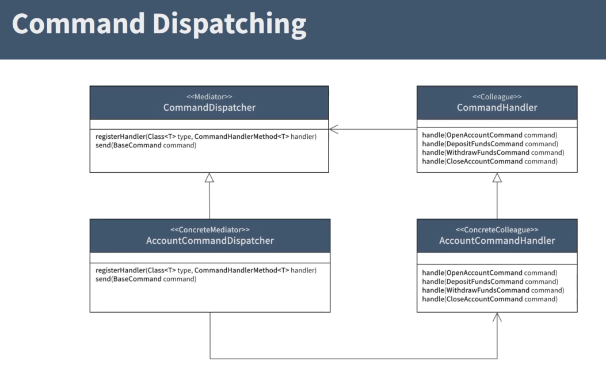

# cqrs-demo

## Project structure

```

|-cqrs
|-bank-account
  |-account-cmd
    |-api  --contain commands, rest controllers, dto
    |-domain  --contain account aggregate, event store repository
    |-infrastructure  --contain infrastructure related code such as the command dispatcher, event producer, event souring handler, event store implementation
  |-account-common
    |-events
    |-dto
  |-account-query
    |-api  --contain queries, rest controllers, dto
    |-domain  --contain account repository, bank account domain entity
    |-infrastructure  --contain infrastructure related code such as the query dispatcher, the consumer implementation, handlers

```

## Messages
Command and event objects are known as message objects, and both requires a unique identifier.

### What is a Command
A command is a combination of expressed intent.
In other words, it describes something that you want to be done.
It also contains the information required to undertake action based on that intent. Commands are named with a verb in the imperative mood. For example, open a card command or deposit funds command.

### What is an Event
Events are objects that describe something that happened in the application. A typical source of events is the aggregate. When something important in the aggregate occurs, it will raise an event.
Events are always named in the past participle. For example, an event might be something like account opened event or funds deposited events

## Mediator Pattern
Simplify communication between objects in an application by introducing a single object known as the mediator that manages the distribution of messages among other objects, 
and in the context of this section, messages are commands.

### Command Dispatcher


## Aggregate
An Aggregate is an entity or group of entities that is always kept in a consistent state.
The Aggregate Root is the entity within the aggregate that is responsible for maintaining this consistent state.
This makes the aggregate the primary building block for implementing a command model in any CQRS based application.
a
## Event Store
Events store is a database that is used to store data as a sequence of immutable events over time, and events store is a key enabler of event sourcing.

Key considerations when designing and event store: 

- An event store must be an append only store, no update or delete operations should be allowed.
Each event that is saved should represent the version or state of an aggregate at any given point in time

- Events should be stored in chronological order and new events should be appended to the previous event

- The state of an aggregate should be recreatable by replaying the event store

- The event store should implement optimistic concurrency control